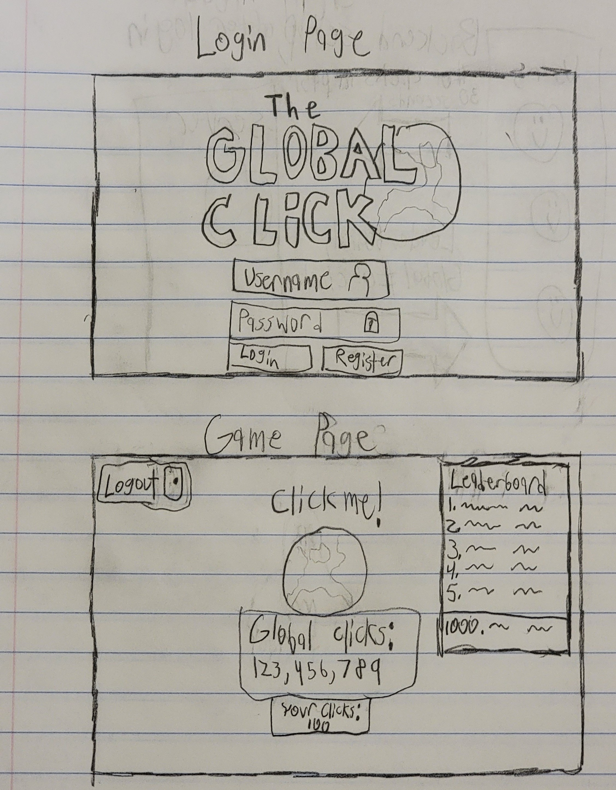
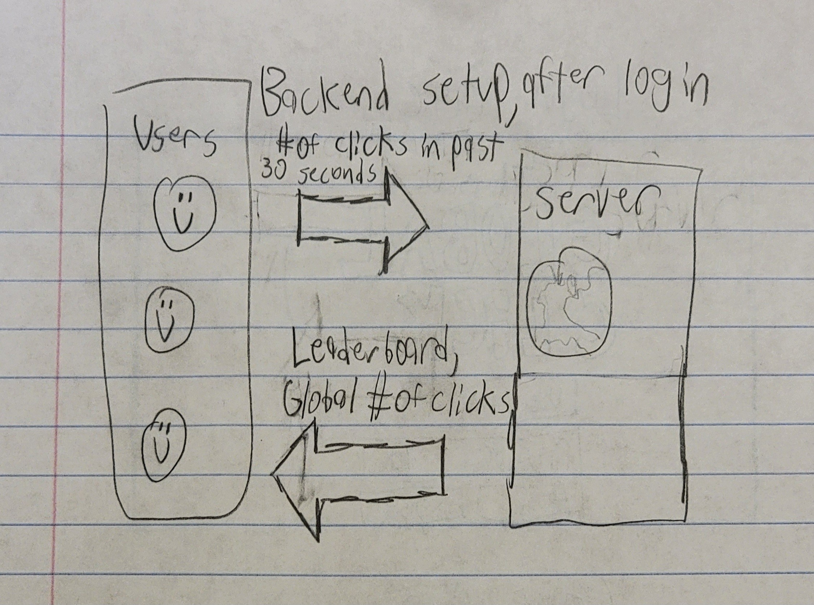

# The Global Click

[My Notes](notes.md)

Everyone in the world contributes to clicking a button, over and over. 
Potential features include: 
* Global leaderboard, with a username/password login
* Unlockable skins for the button after reaching certain milestones. Some are global, some are personal.
* A lucky umbrella, occasionally sent out by the server, which is worth 100 clicks!
* A banner ad so I can make millions
* Whatever else this class requires

## 🚀 Specification Deliverable.

For this deliverable I did the following. I checked the box `[x]` and added a description for things I completed.

- [x] Proper use of Markdown
- [x] A concise and compelling elevator pitch
- [x] Description of key features
- [x] Description of how you will use each technology
- [x] One or more rough sketches of your application. Images must be embedded in this file using Markdown image references.

### Elevator pitch

Clicker games are usually a solitary experience. You click, make an arbitrary number go up, then buy upgrades. Usually these upgrades just make it all happen automatically. Quickly, the number of 'clicks' has lost its sanctity and no longer truly represents a click of the mouse. 
Global Click seeks to restore the sanctity of a 'click' and instead allow for a cooperative experience, where everyone contributes to making the arbitrary number go up.

### Game Design

The initial login page has nothing particularly special, just a logo with the option to login or register.
The game page is a familiar setup, with a big button in the middle begging to be clicked. This is how almost every game in the genre does it. Underneath, there is a regularly updated tally of the number of times every player has clicked the button, along with the user's individual clicks made. There is a leaderboard, displaying the top 5 (maybe top 10) users (with their score, of course) and the user's own placement.

### Server Design

Due to the high volume of both users and 'clicks performed', it is more practical to have users send and receive updates periodically (between 1-60s, depending on what I find the server can handle). That means, instead of making a call everytime the user clicks, it will send a call with a sum of the number of clicks done within the timeframe.
The server will periodically send the user the global number of clicks made, along with the leaderboard in a similar timeframe.

### Key features

- A big button to click!
- Secure login over HTTPS
- A global tally, showing in realtime how many times the button has been clicked globally
- A leaderboard, displaying who has contributed the most to the global click tally.

### Technologies

I am going to use the required technologies in the following ways.

- **HTML** - To handle the basic structure. 2 pages are anticipated, one for login and one for the game itself.
- **CSS** - To style and offer light animation. More importantly, to allow the website page to properly accomodate multiple aspect ratios and resolutions.
- **React** - To handle the logic for login, registration, and logout. Also, I anticipate it is where I will implement the logic for clicking the button (along with other potential game additions).
- **Service** - To offer endpoints for various API calls. This includes:
    - Registration, login, and logout (you are not allowed to click the button unless if you are logged in)
    - To retrieve an individual user's click tally
    - To retrieve the global click tally
    - To send a sum of all clicks made by the user within a timeframe.
    - To contact a 3rd party api to... set the background color! (I honestly will probably perform more research on potential 3rd party APIs to call)
- **DB/Login** - To store users, along with how many times they have clicked the button.
- **WebSocket** - To provide realtime feed of global clicks.

## 🚀 AWS deliverable

For this deliverable I did the following: made it work

- [x] **Server deployed and accessible with custom domain name** - [My server link](https://startup.theglobal.click).

## 🚀 HTML deliverable

For this deliverable I did the following. I checked the box `[x]` and added a description for things I completed.

- [x] **HTML pages** - I added 4 pages. Index.html, for the home page, play.html for the game page, leaderboard.html for the leaderboard, and about.html for the about page.
- [x] **Proper HTML element usage** - I added multiple structure elements to each page, using 
, <aside>, <main>, <header>, <footer> and <table> to build what should be a future-thinking structure.
- [x] **Links** - I made it so that if you click Home, About, Play, Leaderboard, or Github, it will take you to the respective page.
- [x] **Text** - I included placeholder text for every element, along with text for the about section.
- [x] **3rd party API placeholder** - I linked to a 3rd party API to display a random image everytime you load the 'about' page.
- [x] **Images** - I included a Logo, a button for the 'play' page, and a random image in the 'about' section.
- [x] **Login placeholder** - I included placeholder forms for login and registration.
- [x] **DB data placeholder** -  I included placeholder forms for login and registration, along with placeholder information for a leaderboard.
- [x] **WebSocket placeholder** - I included a placeholder 'global click tally' that will be updated in real time... eventually.

## 🚀 CSS deliverable

For this deliverable I did the following. I checked the box `[x]` and added a description for things I completed.

- [x] **Header, footer, and main content body** - There's a header and a footer on the left side of the screen (woahhh rad) that moves to the top/bottom when the screen gets too narrow. Also there's main content on every page.
- [x] **Navigation elements** - The header has 5 skittles you can click on to navigate around the 4 pages of the website (the red "logout" skittle just takes you to the login page, thus being redundant currently)
- [x] **Responsive to window resizing** - Too narrow? Move header/footer to the top/bottom respectively. Too short? Remove the footer. Even shorter? Remove the header.
- [x] **Application elements** - Main page has logo and login form. Play page has button you can click, with two trackers displaying global and personal click count. Leaderboard has a leaderboard. About has some text about this project.
- [x] **Application text content** - There is indeed text where necessary. Every page has a minor amount of text, with the about page having an entire paragraph of it.
- [x] **Application images** - The main page has a logo, the play page has a button (the button image will be updated once it is actually implemented), the about page shows a random image each time you load it.

## 🚀 React part 1: Routing deliverable

For this deliverable I did the following. I checked the box `[x]` and added a description for things I completed.

- [x] **Bundled using Vite** - I installed vite, and used it to structure my program. It now uses a public folder, a src folder, and subfolders! 
- [x] **Components** - In each subfolder, I have .jsx and .css files needed to represent individual components to route to!
- [x] **Router** - Instead of going back and forth with the server, you get everything at once and view different pages using Route and Navlink!

## 🚀 React part 2: Reactivity deliverable

For this deliverable I did the following. I checked the box `[x]` and added a description for things I completed.

- [x] **All functionality implemented or mocked out** - Login, Logout, Play, Leaderboard, and About now all function how they ought to! To Login, you need to put in a username and password. After logging in, your status becomes 'authenticated' and you are able to play (and logout). The login screen also changes slightly. Play will now retain much more information. Every time you click, it will be saved. The 'global clicks' is still a mockup, and pretends to go up over time. The leaderboard is fully functional, and is sorted by rank (and also tells you what YOUR rank is!) The about page didn't change much. 
- [x] **Hooks** - Hooks were absolutely necessary to make the logic work out. Everytime you click, an effect is called and states are changed. Same goes for everytime you view the leaderboard. I even used an interval!

## 🚀 Service deliverable

For this deliverable I did the following. I checked the box `[x]` and added a description for things I completed.

- [x] **Node.js/Express HTTP service** - The backend now constantly runs a server, running an index.js file. 
- [x] **Static middleware for frontend** - I added app.use(express.static('public')); to the index.js file of the service. The frontend will treat anything in the public directory as a static file, so it won't misinterperet them as an endpoint to fetch from.
- [x] **Calls to third party endpoints** - The about page displays a random image (in color! wowww)
- [x] **Backend service endpoints** - The following post endpoints were made: Create User, Login User, and New Score (lowkey with my implementation this one should be a put. Oh well!). The following get endpoints were made: Get Leaderboard, Get Global Count. A delete endpoint for Logout was made.
- [x] **Frontend calls service endpoints** - The login page calls the Login/Create endpoint when Login/Create buttons are pushed respectively. The play page calls the Get Leaderboard endpoint when first loading to sync the user's data with that of the server. When the player clicks the button, the New Score endpoint is called. The Leaderboard page simply calls the Get Leaderboard endpoint to fill up its array of data. The About page calls a third party to get a random image, and also calls the Get Global Count endpoint to display the current global count. The play page does not call this endpoint because on that page it is planned on being implemented with a websocket. However, I still wanted to prove that the global count is being tracked by the server.
- [x] **Supports registration, login, logout, and restricted endpoint** - Registration, Login, and Logout have all been implemented, and function as you would expect. Most endpoints are not restricted, notably the Get Leaderboard endpoint, which in Simon is restricted but I saw no reason to restrict it. The only restricted endpoint is the Post Score endpoint. If a player accesses the /play page without being logged in, they will be alerted of their authentication status if they click the button.

## 🚀 DB deliverable

For this deliverable I did the following. I checked the box `[x]` and added a description for things I completed.

- [x] **Stores data in MongoDB** - Two non-credential collections exist. The more substantial one is the 'score' collection, storing a username-score combo. Each person only has one score. The more superficial one is the globalScore collection, which literally only stores one score. This score, of course, is the Global Score (all other scores combined). This was placed in a separate collection to make the implementation of the leaderboard not have to account for a score it needs to ignore. In hindsight, I very well could have made globalCount just show the sum of all other scores instead of being tracked separately. Oh well!
- [x] **Stores credentials in MongoDB** - A 'users' collection exists in MongoDB, associating a username with a password and an authToken. The passwords are, of course, encrypted.

## 🚀 WebSocket deliverable

For this deliverable I did the following. I checked the box `[x]` and added a description for things I completed.

- [ ] **Backend listens for WebSocket connection** - I did not complete this part of the deliverable.
- [ ] **Frontend makes WebSocket connection** - I did not complete this part of the deliverable.
- [ ] **Data sent over WebSocket connection** - I did not complete this part of the deliverable.
- [ ] **WebSocket data displayed** - I did not complete this part of the deliverable.
- [ ] **Application is fully functional** - I did not complete this part of the deliverable.
