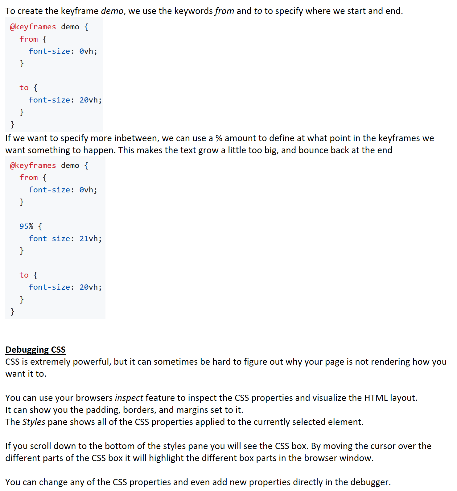
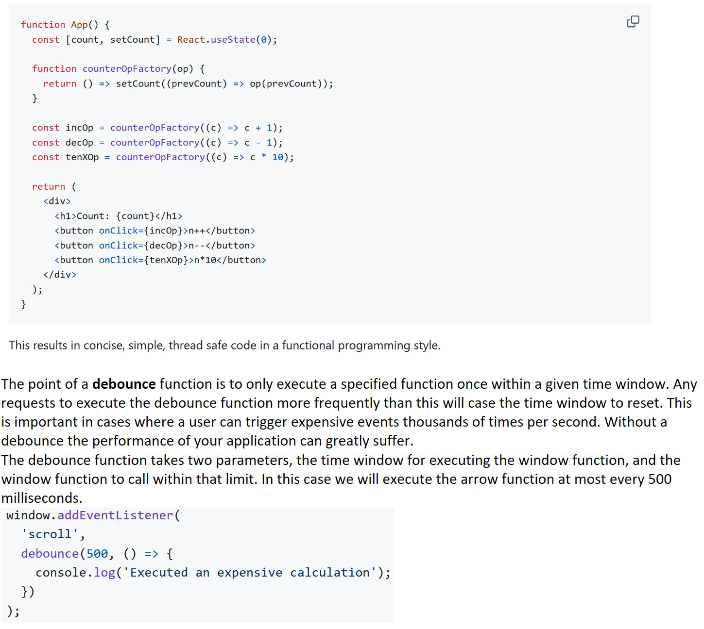

# CS 260 Notes
# Look, I'm going to be honest: I don't want to keep my notes here. I want to keep my notes in OneNote, the digital notebook I've used for every other class in college. 
[My startup - The Global Click](https://startup.theglobal.click)

## Helpful links

- [Course instruction](https://github.com/webprogramming260)
- [Canvas](https://byu.instructure.com)
- [MDN](https://developer.mozilla.org)

# Github notes
Here are my personal notes for github. I've used Github Desktop for a time now, and am familiar with repositories, cloning, branches, and forks. However, I have seldom used console commands myself so I have written them down here.

## git add {filename}
Puts {file} into stage

## git commit -am "{string}"
Commits all staged files, with {string} as the commit message.

## git push
Pushes all committed files to the origin (the server)

## git pull
Pulls all files from the origin (the server) to your machine.

## git diff --name-only --staged
Shows the names of all changed files in the stage.

## AWS
Here is what I have learned so far:
* My Elastic IP Address is 18.213.222.208
* An Elastic IP Address will redirect to my AWS Instance's IP Address, so that the IP refresh that happens when I restart my instance doesn't screw everything up.
* I am using an AMI (Amazon Machine Image) provided by the CS260... people.
* I can ssh into my server by providing a key using the following command:ssh -i [key pair file] ubuntu@[ip address]
* DNS stands for Domain Name System. It turns domain names into IP addresses.
* Browsers store a cache of domain name-ip address references. If your computer doesn't know it, it will go to a DNS server. If that server doesn't know it, it will go to an authoritative name server. If it isn't there, it will tell you that it is an unknown domain.
* My domain is theglobal.click
## Caddy
Nothing yet.
## HTML
Nothing yet.
## CSS
Nothing yet.
## React Part 1: Routing
Nothing yet.
## React Part 2: Reactivity
Nothing yet.

